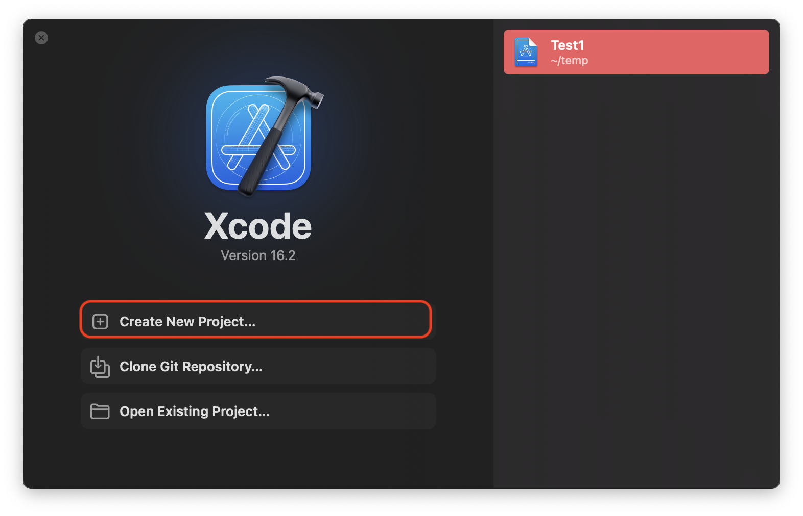
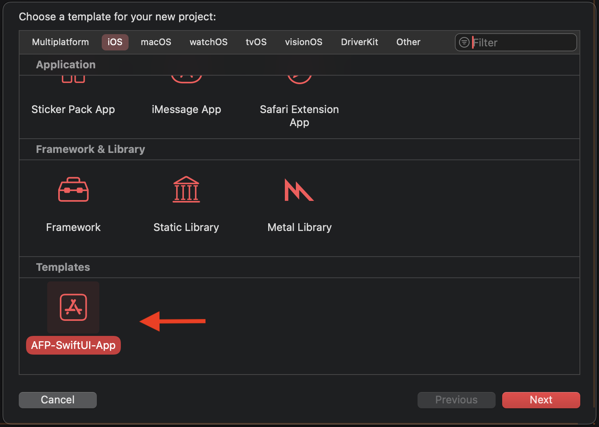

# Xcode-template
Xcode template for working with git.

# Installation

1. Clone this git repository

```
cd temp
git clone git@github.com:RMIT-Ace/Xcode-template.git
```

2. Run `install.sh`

```
cd Xcode-template
cd utils
./install.sh
```

3. Quit and reopen Xcode

# Using RMIT AFP SwiftUI Template





# Checking the Contents of New Project

```bash
$ cd PROJECT_DIR
$ tree -L 1 -a
.
├── .git
├── .gitignore       <<- Git Ignore file
├── Test2
└── Test2.xcodeproj
```

Verify `.gitignore` contents.

```
.DS_Store
*.xcuserstate
xcuserdata/
project.xcworkspace/
```
